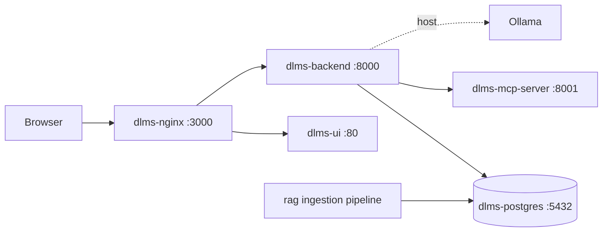

# DLMS/COSEM Hybrid Agentic RAG Assistant

An offline assistant for **DLMS/COSEM protocol analysis** and **SICONIA HES/DCU troubleshooting**.  
It combines deterministic Java decoding, hybrid retrieval, session memory, anomaly detection, and bounded LLM planning so engineers can investigate frames, payloads, alarms, traces, uploads, and support knowledge inside controlled environments.

## Why this project exists

Field troubleshooting for smart metering systems usually involves two hard problems at once:

- protocol data must be decoded correctly
- operational knowledge is scattered across logs, traces, standards, and support material

This project brings both into one local system:

- deterministic parsers provide protocol truth
- retrieval provides grounded evidence
- the LLM explains only what the system can support

## What makes it hybrid agentic RAG

- **Deterministic truth layer**  
  HDLC, APDU, AXDR, OBIS, XML, log, and alarm interpretation are handled by code and remain authoritative.
- **Agentic reasoning layer**  
  the planner decides when to use retrieval, session memory, or deterministic tools for natural-language and mixed prompts.
- **Grounded answer layer**  
  final answers are constrained by deterministic results and retrieved evidence instead of free-form guessing.

## Current validated snapshot

- **Deployment:** 5 containers  
  `dlms-ui`, `dlms-nginx`, `dlms-backend`, `dlms-postgres`, `dlms-mcp-server`
- **Model runtime:** Ollama on the host, not inside Docker
- **Default local model:** `qwen2.5:3b`
- **Knowledge Graph:** 51 nodes, 28 edges
- **Retrieval corpus:** 8,659 DLMS chunks + 2,516 Confluence chunks
- **Hybrid retrieval weighting:** `0.7 x vector + 0.3 x BM25`
- **Anomaly detection:** 8 runtime rules
- **Automated verification:** 655 backend tests + 103 frontend tests

## Architecture overview



## Orchestration modes

| Mode | When it is used | Typical examples |
| --- | --- | --- |
| `DETERMINISTIC_FAST_PATH` | The input is clearly a frame, APDU, AXDR value, alarm, XML trace, log block, or OBIS lookup | `7EA00A030383CD6F7E`, `C4020109060100010800FF`, `0x1342` |
| `STRUCTURED_PLUS_AGENTIC` | A strong structured payload is combined with a natural-language request | `Decode APDU C4020109060100010800FF and explain what object was returned` |
| `NATURAL_LANGUAGE_AGENTIC` | The input is a pure question or follow-up | `What is AARQ in DLMS?`, `what OBIS code was in the last response?` |
| `AMBIGUOUS_SAFE_FALLBACK` | Multiple interpretations are plausible and the system should not guess | malformed or mixed structured inputs |

## Core capabilities

### Deterministic DLMS analysis

- HDLC frame parsing
- APDU classification
- AXDR primitive and structure decoding
- OBIS resolution
- GBT-aware decoding support
- multi-artifact turn decomposition and per-artifact rendering

### SICONIA troubleshooting

- alarm code decoding
- XML trace parsing
- multi-line log classification
- operational remediation hints

### Agentic assistance

- documentation and security Q&A
- session-aware follow-up resolution
- persisted conversation memory
- safe `How I answered` trace with mode, strategy, tools, and trust

### Platform features

- JWT authentication and RBAC
- admin panel for users, feedback, health, and reflection stats
- conversation persistence, search, and export
- click upload and drag-and-drop upload support

## Example prompts

### Deterministic decode

```text
7EA00A030383CD6F7E
```

```text
C4020109060100010800FF
```

```text
00
```

### Mixed decode + explanation

```text
7EA00A030383CD6F7E what does this do?
```

```text
Decode APDU C4020109060100010800FF and explain what object was returned.
```

### Multi-artifact turn

```text
7EA00A030383CD6F7E

03 01

C4020109060100010800FF
```

### Natural-language grounded questions

```text
What is the difference between AARQ and AARE in DLMS?
```

```text
How does replay protection work in DLMS?
```

```text
what OBIS code was in the last response?
```

### SICONIA

```text
0x1342
```

```text
Analyze and explain this SICONIA alarm in context, and suggest remediation: 0x1342
```

## Technology stack

| Layer | Stack |
| --- | --- |
| Backend | Java 25, Spring Boot 3.4.4, Spring WebFlux, LangGraph4j |
| Frontend | React, Ionic, TypeScript, Vite |
| Database | PostgreSQL, pgvector, R2DBC |
| Retrieval | vector search + BM25 |
| Tool surface | Python FastAPI MCP server |
| Ingestion | Python offline chunking and embedding pipeline |
| Infra | Docker Compose, Nginx, Ollama |

## Quick start

### Prerequisites

- Docker Desktop or a compatible Compose runtime
- Java 25
- Maven 3.9+
- Node 20+ for local UI development
- Ollama installed on the host

### 1. Pull the local models

```powershell
ollama pull qwen2.5:3b
ollama pull nomic-embed-text
```

### 2. Create the backend environment file

```powershell
Copy-Item backend/.env.example backend/.env
```

Then update the secrets in `backend/.env`.

### 3. Package the backend

```powershell
cd backend
mvn clean package -DskipTests
cd ..
```

### 4. Start the full stack

```powershell
docker-compose up --build -d
```

### 5. Verify the deployment

```powershell
docker ps
curl http://localhost:3000/api/actuator/health
curl http://localhost:3000/api/mcp/health
```

### Podman / corporate note

If your container runtime cannot resolve `host.docker.internal`, set the host alias before startup:

```powershell
$env:OLLAMA_HOST="host.containers.internal"
docker-compose up --build -d
```

The compose file uses that override for both the backend and MCP container path to Ollama.

### Main endpoints

- App: `http://localhost:3000`
- Backend health: `http://localhost:3000/api/actuator/health`
- MCP health: `http://localhost:3000/api/mcp/health`
- PostgreSQL host access: `localhost:5433`

## Development

### Backend

```powershell
cd backend
mvn clean test
```

### Frontend

```powershell
cd ui
npm install
npm run dev
```

### Frontend unit tests

```powershell
cd ui
npm run test.unit -- --run
```

The UI repo also includes Cypress and Playwright coverage for browser workflows.

## Repository layout

```text
.
|-- backend/       Spring Boot backend, orchestration, APIs, tests
|-- ui/            React + Ionic frontend
|-- mcp_server/    FastAPI MCP transport and tool exposure
|-- rag/           Offline ingestion pipeline
|-- docker-compose.yml
`-- README.md
```

## Security and design invariants

- no cloud dependency is required at runtime
- deterministic protocol parsing is never delegated to the LLM
- JWT auth, RBAC, audit logging, and output filtering are built in
- `SESSION_ENCRYPTION_KEY` must remain exactly 16 characters
- Ollama is intentionally external to Docker so the system can later switch to a stronger local or enterprise model without redesigning the application containers

## Public snapshot note

This public repository intentionally excludes private or bulky project assets such as:

- report sources and generated PDFs
- internal docs and specs
- offline Confluence exports and processed knowledge packs
- local auth state, build artifacts, crash logs, and virtual environments

The repository is kept focused on the runnable codebase.
